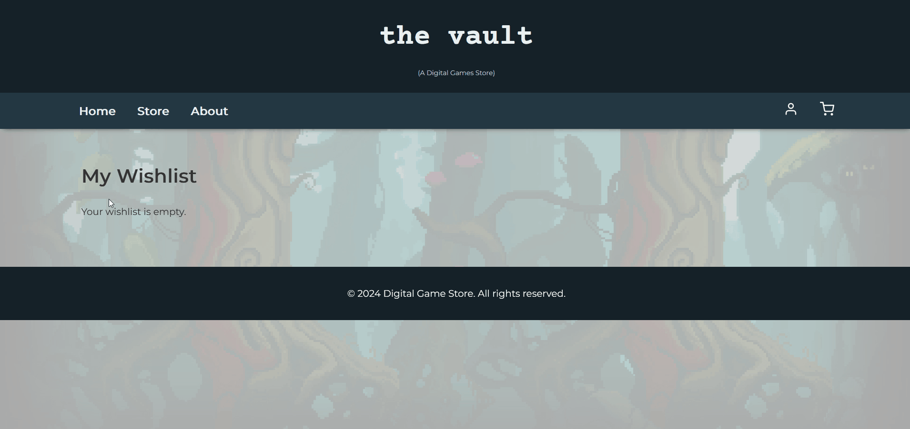
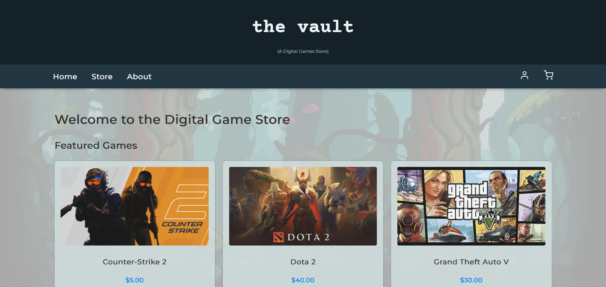
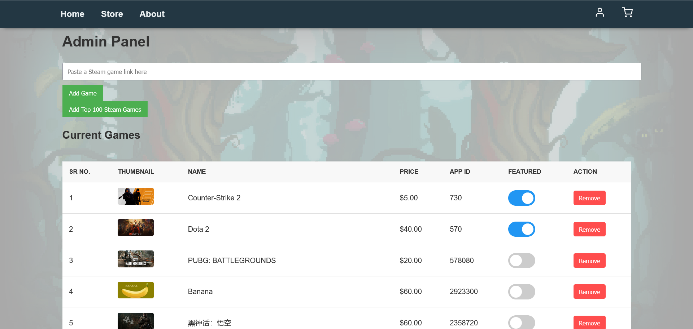

# the vault

A digital games marketplace with an AI recommendation engine.

To see deployed live version of the project - www.vyaduvanshi.pythonanywhere.com

 

## Highlighted Features

### Recommendation Engine in Action

The GIF below demonstrates how the recommendation engine activates dynamically.
When the wishlist is empty, no recommendations are shown.
Once a game is added, the engine instantly analyzes the wishlist data and generates personalized suggestions.

### Home Page

### Admin Panel

 

## Tech stack used

**Frontend - HTML, CSS, JavaScript:** 

Jinja2 templates render dynamic storefront, checkout, and admin pages, while static assets handle styling and interactive touches like cart counters and wishlist toggles.
**Web app backend - Python (Flask + Jinja2):**

Flask maps routes, validates forms, exposes JSON endpoints for cart/wishlist updates, and injects shared context into templates through Jinja2.
- **Database - SQLite:** Persists user profiles (username, email, password hash), purchase history, wishlist relationships, and game metadata (name, description, banner image) inside instance/games.db; SQLAlchemy makes it easy to point at PostgreSQL/MySQL later.
- **Web scraping / API calls - Requests:** scraping.py uses Requests (with optional BeautifulSoup parsing) to fetch Steam listings that admins can bulk import directly into the catalog.
- **Data manipulation - NumPy & Pandas:** Power the recommendation engine preprocessing pipeline, turning raw CSV gameplay logs into clean user/game matrices and feature frames.
- **Graphing - Plotly:** Supports exploratory notebooks that visualise catalog trends and model performance when presenting insights.
- **Artificial Intelligence - Python, Jupyter, Keras, TensorFlow:** Notebook-driven experiments train the RBM with TensorFlow/Keras tooling, while the Flask app loads the exported checkpoint for real-time recommendations.

 

## How the recommendation engine works (Restricted Boltzmann Machine)

A Restricted Boltzmann Machine (RBM) is a type of neural network that learns hidden patterns in data.
In a recommendation system, RBMs help predict what items a user might enjoy next by learning relationships between users and items.

- Model structure: An RBM is a two-layer neural network with a visible layer (game choices) and a hidden layer (tries to learn *why* the user liked those movies). Each visible unit connects to every hidden unit, but there are no lateral connections within a layer, which simplifies training.
- Training objective: The RBM learns to reconstruct user-game interaction vectors. For this project, each training sample is a binary or weighted vector indicating whether a user played or liked a particular game. During training, Contrastive Divergence adjusts weights so reconstructed vectors resemble the originals.
